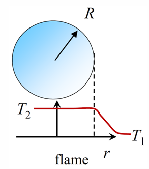
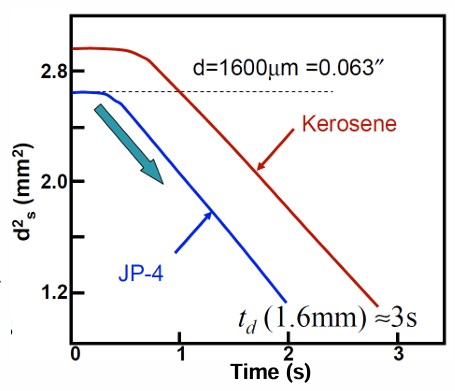

??? example "What is combustion"
    Self-sustained rapid oxidation generating heat, or both light and heat.

??? example "In combustion what is equilibrium"
    Where the reaction is heading if given enough time

??? example "What is kinetics"
    Considers chemical rates. How fast an reaction occurs tending towards equilibrium

??? example "Equivalence ratio$"
    $$\Phi=\frac{f_{actual}}{f_{stoichiometric}}$$

??? example "What is f with respect to equivalence ratio"
    Fuel to oxidizer ratio

??? example "Stoichiometric vs lean vs rich (equivalence ratio)"
    - Stoichiometric $\Phi=1$
    - Lean $\Phi<1$
    - Rich $\Phi>1$

??? example "General balance of $C_xH_y+aO_2\rightarrow bCO_2+cH_2O$"
    - $a=x+y/4$
    - $b=x$
    - $c=y/2$

??? example "Typical values of nitrogen and oxygen in air"
    - $\chi_{N_2}=0.79$
    - $\chi_{O_2}=0.21$

??? example "What is adiabatic flame temperature"
    Equilibirum temperature that would be achieved if reactants were converted to equilibirum products without heat addition or loss

??? example "Relationship between sensible enthalpy and enthalpy of formation"
    $$h_i(T)=\underbrace{[h_T-h_{T_{ref}}]_i}_{\text{sensible}}+\underbrace{[\Delta h_{f,T_{ref}}^o]}_{\text{enthalpy of formation}}$$

??? example "Adiabatic flame temperature calculation for constant volume, constant pressure"
    - const P $H_r=H_p$
    - const V $H_r-H_p-R(N_rT_i-N_pT_{ad})=0$

??? example "What is heating value"
    Chemical to thermal energy conversion possible by burning 1 unit of fuel

    - $Hv=\{H_r-H_p\}/m_{fuel}$

??? example "Stoichiometric $T_{ad}$ for $CH_4$, $C_3H_8$, $C_2H_2$, $CO$, $H_2$"
    - $CH_4$: 2226 
    - $C_3H_8$: 2267
    - $C_2H_2$: 2539
    - $CO$: 2275
    - $H_2$: 2390

    Units in Kelvin

??? example "What is the impact of pressure on $T_{ad}$"
    Delays dissociation which increasing the $T_{ad}$

??? example "For typical HC-Air combustion, what are major species? Lean? Rich?"
    === "Major"
        - $H_2O$
        - $CO_2$
        - $N_2$
    === "Rich"
        - All major species
        - $O_2$
    === "Lean"
        - All major species
        - $CO$
        - $H_2$

??? example "What is the major/minor species model"
    - Products of combustion contain more than just ideal products
    - Major species dissociate, producing minor species
    - Amount of CHON atoms are conserved

??? example "HOw do you set up a chemical equilibrium problem"
    Atom conservation, Kp, etc.

??? example "Molecular collision rate"
    $$\zeta=n_A n_B\sigma_{AB}\sqrt{8kT/\pi\mu}$$

??? example "Do all collisions result in a reaction"
    No. Activation energy

??? example "What is the energy barrier of collision"
    Activation energy. Limits on which collisions have sufficent relative kinetic energy to cause a change in internal energy

??? example "Graphically show the relationship between energy and reactions"
    <figure markdown="span">
        
    </figure>
    - Inelastic collisions have changes in internal energy which equate to changes in kinetic energy.

??? example "Arrhenius form for the reaction rate"
    $$R=n_A n_B\sigma_{AB}\sqrt{8kT/\pi\mu}e^{-\varepsilon/RT}$$

??? example "Graphical Arrhenius rate law"
    <figure markdown="span">
        
    </figure>

??? example "Modified Arrhenius Rate"
    $$k=AT^be^{\frac{E_a}{\bar{R}T}}$$

??? example "Global vs Elementary reaction rates"
    Global reaction rates are the top level overall description. However, most reactions have intermediate mechanisms which leads to the global. This  are the elementary reactions rates (detailed mechanism)

??? example "What is reaction rate of $N+N+O\rightarrow NO+N$"
    $$\frac{d[N]}{dt}=RR(1-2)=-RR=-k[N]^2[O]$$

    $$\frac{d[NO]}{dt}=RR=k[N]^2[O]$$

??? example "Related $k_f$, $k_r$, and $K_c$"
    $$K_c=\frac{k_f}{k_r}$$

??? example "What is order vs molecularity"
    - For termolecular, bimolecular, and unimolecular the molecularity is 3, 2, 1 respectively
    - For order, the value is the sum of the reaction rate exponents

??? example "What is the steric factor"
    - Molecule structure effects on collision efficiency. Accounts for non spherical symmetry
    - $k=k_{coll}\times P_{steric}$

??? example "What is the activated collision complex"
    A temporarily formed molecule formed from an unstable collision complex. Activation energy required to form the complex.

??? example "What is the potential energy surface"
    Math function that gives energy of a molecule as a function of goemetry

??? example "Lindemann Mechanism"
    - $A\overset{k_1}{\rightarrow}products$
    - $A+M\overset{k_e}{\rightarrow}A^*+M$
    - $A^*+M\overset{k_{de}}{\rightarrow}A+M$
    - $A^*\overset{k_{uni}}{\rightarrow}products$

??? example "From Lindemann Mechanism, what is production rate"
    $$\frac{d[prod]}{dt}=k_{uni}[A^*]$$

??? example "Zeldovich mechanism"
    - $N_2+O\leftrightarrow NO+N$
    - $O_2+N\leftrightarrow NO+N$
    - $\tau$ decreases when $T>1700$ K

??? example "Bimolecular reaction time"
    $$\tau_{chem}=\frac{[N]-[N]_o}{d[N]/dt}=\frac{1}{k_{1f}[M]}$$

??? example "Partial Equilibrium Assumption"
    Forward and backward rates are much larger than the net reaction rate. This applies to specific species.

??? example "Steady State Assumption"
    - $d[M]/dt=0$
    - Applies to specific species

??? example "Various forms of net production rate"
    $$\dot{\omega}_M=\frac{d\omega_M}{dt}=\rho\frac{dY_M}{dt}=MW_M\frac{d[M]}{dt}$$

??? example "Types of radical reactions"
    - Chain initiation ($\Delta R$ +2) 
        - Creates radical without radical reactant
    - Chain propagating ($\Delta R$ 0) 
        - Use and produce same number of radicals
    - Chain branching ($\Delta R$ +1) 
        - Net production of radicals
    - Chain terminating ($\Delta R$ -2) 
        - Net destruction of radicals

??? example "What is an explosion"
    Rapidly accelerating fast reaction

??? example "H2-O2 first explosion limit"
    - Net production of radicals too slow
    - $d[H]/dt=k_{wall}[H]$
    - $\frac{d[H]_+/dt}{d[H]_{\_}/dt}\propto P$

??? example "H2-O2 second explosion limit"
    - $HO_2$ removes $H$ acts as a termination path
    - $\frac{d[H]_+/dt}{d[H]_{\_}/dt}\propto P^{-1}$

??? example "H2-O2 third explosion limit"
    - At higher pressures $HO_2$ eventually becomes chain branching
    - $\frac{d[HO_2]_{branch}/dt}{d[HO_2]_{term}/dt}\propto P^{-1}$

??? example "Induction period"
    Characterized by radical build up

??? example "Dry CO explosion mechanism"
    $$CO+\frac{1}{2}O_2\leftrightarrow CO_2$$

??? example "Wet CO explosion mechanism"
    - $CO+OH\rightarrow CO_2+H$
    - $H+O_2\rightarrow OH+O$
    - $O+HC\rightarrow OH$

??? example "What are differences betweens alkanes, alkenes, and alkynes"
    Single, double, and triple CC bonds, respectively.

??? example "Four ways of oxidizing $HC$"
    - $H_2O_2$
    - $HC$
    - Wet $CO$
    - $NO_x$

??? example "Extended Zeldovich Mechanism"
    - $OH+N\leftrightarrow NO+H$
    - Also known as thermal $NO$ mechanism

??? example "Intermediate $N_2O$ mechanism"
    - $N_2+O+M\leftrightarrow N_2O+M$
    - $H+N_2O\leftrightarrow NO+NH$
    - $O+N_2O\leftrightarrow NO+NO$
    - Medium to high activation energy
    - Low temperature, lean, and high pressure conditions

??? example "NNH mechanism"
    - $N_2+H+M\leftrightarrow NNH+M$
    - $NNH+O\leftrightarrow NO+NH$
    - $T>2200$, $\Phi\leq 1$, short $\tau_{res}$
    - $T<1900$, $\Phi=1$

??? example "Fenimore mechanism"
    - $CH+N_2\leftrightarrow HCN+N$

??? example "$NO_2$ mechanism"
    - $NO+HO_2\leftrightarrow NO_2+OH$
    - Oxidizes in atmosphere

??? example "Damkohler number"
    $$Da=\frac{\tau_{flow}}{\tau_{chem}}$$

??? example "What happens when Da goes to 0? $\infty$"
    Uniform, no mixing

??? example "Type of closed reactor models"
    Batch reactors. Constant p and constant v

??? example "Type of open reactors"
    Flow reactor. Well stirred reacted, plug flow reactor, shock tube.

??? example "$dT/dt$ euqation for constant pressure batch reactor"
    $$\rho c_{P_{mix}}\frac{dT}{dt}=\dot{q}^{'''}_{external}(t)-\sum_i\bar{h}_i(T)\dot{\omega}_i$$

??? example "$dT/dt$ euqation for constant volume batch reactor"
    $$\rho c_{V_{mix}}\frac{dT}{dt}=\dot{q}^{'''}_{external}(t)-\sum_i\bar{e}_i(T)\dot{\omega}_i$$

??? example "Plug flow reactor assumptions"
    1. Steady flow
    2. Neglegible kinetic energy
    3. 1-d flow
    4. No axial diffusive transport
    5. No-wall reaction

    $Da>>1$

??? example "Reynolds Transport Theorem"
    $$\left.\frac{dB}{dt}\right |_{CM}=\underbrace{\frac{d}{dt}\int_{CV}\rho\beta dV}_{\text{Rate of change}}+\underbrace{\int_{CS}\rho\beta(\vec{u}_{rel}\cdot\vec{n})dA}_{Net flux}$$

??? example "Plug flug reactor equations"
    === "Mass"
        $$\frac{d(\rho u_x A)}{dx}=0$$

    === "Species"
        $$(\rho u_x)\frac{dY_i}{dx}=\dot{\omega}_i MW_i$$

    === "Energy"
        $$\rho u_x c_{P_{mix}}\frac{dT}{dx}=\dot{q}^{'''}_{in}-\sum_i h_i\dot{\omega}_i MW_i$$

    === "Momentum"
        $$(\rho u_x A)\frac{du_x}{dx}=-A\frac{dP}{dx}-\tau_w p$$

??? example "Induction time (Autoignition delay)"
    Time before significant amount of reaction

??? example "Well Stirred Reactor assumptions"
    1. Fix later

    $Da<<1$

??? example "Well stirred reactor equations"
    === "Mass"
        $$\frac{d(\rho V)}{dt}=\dot{m}_{in}-\dot{m}_{out}$$

    === "Species"
        $$\frac{dY_i}{dt}=\frac{\dot{m}_{in}}{\rho V}(Y_{i,in}-Y_i)+\frac{\dot{\omega}_i MW_i}{\rho}$$

    === "Energy"
        $$c_{p,mix}\frac{dT}{dt}=\frac{\dot{m}_{in}}{\rho V}\sum_i Y_{i,in}(h_{i,in}-h_i)-\frac{\sum_i h_i\dot{\omega}_i MW_i}{\rho}+\frac{\dot{q}^{'''}_{in}}{\rho}-\frac{1}{\rho}\frac{dP}{dt}$$

    === "Residence Time"
        $$\frac{\rho V}{\dot{m}_{in}}=\frac{m}{\dot{m}_{in}}=\tau_{res}$$

??? example "What is the hysteresis from well stirred reactors"
    === "Explanation"
        - For low activation energies there is no S curve phenomena
            -Reaction rates are not sensitive to T
        - For high activation energies there are multivalued solutions
            - Upper and lower branches stable
            - Middle branch unstable
            - Large activation energies leads to more separation of ignition and extinction
            - Reaction rates sensitive to T
        

    === "Diagram"
        <figure markdown="span">
            
        </figure>

??? example "For the dimensionless ratios, what are variables $D$, $\alpha$, $\nu$"
    Mass diffusivity, thermal diffusivity, and kinematic viscosity

??? example "What are the dimensionless ratios Pr, Sc, Le"
    - Prandtl number $Pr=\nu/\alpha$
    - Schmidt number $Sc=\nu/D$
    - Lewis number $Le=\\alpha/D$

??? example "Soret vs Dufour effect"
    - Soret is thermally induced mass diffusion
        - Temperature gradient induces heavier molecules to go from high T to low T regions
    - Dufour is species gradient induced energy diffusion
        - Reciprocal to Soret

??? example "Molecular diffusion"
    Transport of flui propagation by random molecular motion

??? example "Transport equations for energy"
    $$\rho c_P \frac{DT}{Dt}=\underbrace{\frac{DP}{DT}}_{\text{Compressive work}}+\underbrace{\nabla\cdot(\lambda\nabla T)}_{\text{Thermal conduction}}-\underbrace{\sum_i c_{P_i}\bar{j}_i\cdot\nabla T}_{\text{Diffusion of sensible enthalpy by mass}}-\underbrace{\sum_i MW_i\dot{\omega}_i h_i}_{\text{Chemical energy conversion}}$$

??? example "Shvab-Zeldovich Formation"
    === "Assumptions"
        1. Steady
        2. No body forces
        3. Normal diffusion
        4. Negligible radiation and viscous dissipation
        5. One D to describe all mass diffusion
        6. Le=1 ($\alpha=D$)
    === "Energy Equation"
        $$\nabla\cdot (\rho\vec{v}h_{sens}-\rho\alpha\nabla h_{sens})=-\sum_i h^o_{i,f} MW_i\dot{\omega}_i$$

    === "Species Equation"
        $$\nabla\cdot (\rho\vec{v}Y_{i}-\rho D\nabla Y_i)=MW_i\dot{\omega}_i$$

??? example "Premixed vs Non-premixed"
    Whether fuel and oxidizer already before entering combustion zone

??? example "Deflagration"
    Subsonic waves. Flame, no significant pressure rise (expansion)

??? example "Detonation"
    Supersonic waves. Flame/shock wave, significant pressure rise (compression)

??? example "Observed deflagration and detonation differences"
    |       | Deflagration | Detonation |
    | :---- | :----------- | :--------- |
    |    $M=u_{wave}/a_u$  | $10^{-4}-0.03$ | $5-10$ |
    |    $p_2/p_1$  | $0.98-1$ | $10-60$ |
    |    $T_2/T_1$  | $4-15$ | $8-21$ |
    |    $\rho_2/\rho_1$  | $1/15-1/4$ | $1.4-2.6$ |

??? example "Deflagration and Detonation governing assumptions"
    1. Steady
    2. Adiabatic
    3. No work but flow
    4. IDeal gases
    5. Negligible viscous effects

??? example "Governing equations of 1-D combustion waves"
    === "Mass"
        $$\rho_2 u_2=\rho_1 u_1=\dot{m}^{''}$$

    === "Momentum"
        $$P_1+\rho_1 u_1^2=P_2+\rho_2 u_2^2$$

    === "Energy"
        $$h_{1,sens}+\frac{u_1^2}{2}+q=h_{2,sens}+\frac{u_2^2}{2}$$

    === "Equation of State"
        $$P=\rho\frac{\bar{R}}{MW_i}T$$

??? example "Rayleigh Line"
    === "Equation"
        $$-\dot{m}^{''2}=-(\rho_1 u_1)^2=-(\rho_2 u_2)^2=\frac{P_2-P_1}{1/\rho_2-1/\rho_1}$$

    === "Diagram"
        <figure markdown="span">
            
        </figure>

??? example "Rankine-Hugoniot Curve"
    === "Equation"
        $$q=\frac{\gamma}{\gamma-1}\left(\frac{P_2}{\rho_2}-\frac{P_1}{\rho_1}\right)-\frac{1}{2}(P_2-P_1)\left(\frac{1}{\rho_1}+\frac{1}{\rho_2}\right)$$

    === "Diagram"
        <figure markdown="span">
            
        </figure>

??? example "Chapman-Jouguet Points"
    === "Description"
        Where rayleigh and hugoniot are tangent represent CJ solution points.
        - At CJ points, $u_2=a_2$, or $M_2=u_2/a_2=1$

    === "Diagram"
        <figure markdown="span">
            
        </figure>

??? example "What are some regions allowed and others not"
    - Strong deflagration can't exist since it requires subsonic to increase to supersonic flow
        - violates second law
    - Weak deflagrations are allowed since it does not violate
    - Strong detonation does not violate laws, but not observed as a steady, self sustained process
    - Weak detonations not allowed due to normal detonation stucture
        - violates second law

??? example "ZND Model: Detonation Structure"
    <figure markdown="span">
        
    </figure>

??? example "Why does molecular collision normally proceed chemical reactions"
    - Characteristic momentum transfer collision < 1 ns
    - Characteristic chemical reactions > 1 $\mu$s

??? example "Detonation wave speed"
    $$D=\frac{\gamma_2+1}{\gamma_2}\sqrt{\gamma_2\frac{\bar{R}}{MW_2}T_2}$$

??? example "What happens to detonation is too lean or too rich"
    Can't get self sustained detonation. Terminates.

??? example "2-D vs 3-D detonation structure"
    Triple point tracks

??? example "Plane laminar flame structure"
    <figure markdown="span">
        
    </figure>

??? example "Free body diagram of flame"
    <figure markdown="span">
        
    </figure>

??? example "What are flame zones and the related boundary conditions"
    - The broken down flame zones are preheat and reaction zones
    - If $T<T_i$, no reactions
    - If $T>T_i$, reactions activated ($\propto e^{E_a/RT}$)

??? example "Flame Speed"
    === "Description"
        $$S_L^o=\sqrt{\frac{2}{\rho_1 Y_{f,1}}\bar{\alpha}\overline{RR}}\propto\sqrt{\bar{\alpha}\overline{RR}}\propto\sqrt{\bar{\alpha}\tau_{chem}}$$

        - $\bar{\alpha}$ - Diffusive transport of energy (and species) from reaction zone into unburned gases
            - prepares them to start reacting
        - $\frac{\overline{RR}}{\rho_1}$ - Chemical kinetics (rate of heat relase/radical production)
            - Source of energy/species diffusing into unburned gas

    === "Order of magnitude"
        - $\bar{\alpha}$ ~ $10^{-5} - 10^{-4}$ $m^2/s$
        - $\tau_{chem}$ ~ $10^{-4} - 10^{-3}$ $s$ (after reactants "preheated")
        - $S_L^o$ ~ $O(0.01-1\text{ m/s})$

??? example "What is flame thickness"
    $$\delta_f=\delta_{ph}+\delta_r=\frac{\alpha}{S_L^o}\propto\sqrt{\alpha\tau_{chem}}$$

??? example "Relate zeldovich nummber to zone thickness"
    $$\frac{\delta_R}{\delta_{ph}}=\frac{RT_2^2/E_a}{T_2-T_1}=\frac{1}{Ze}$$

??? example "Flame speed scaling laws"
    === "Pressure"
        $$S_L^o\propto\sqrt{\alpha RR/\rho_1}\propto P^{\frac{n-2}{n}}$$

    === "Temperature"
        $$S_L^o\propto T_1\bar{T}^{m/2}T_2^{-n/2}e^{-E_a/2RT_2}$$

    === "Molecular Weight"
        $$S_L^o\propto \sqrt{\frac{1}{\bar{c}_p MW^m}}$$

??? example "$\Phi$ vs $S_L^o$ for alkanes, alkenes, alkynes, and H2"
    <figure markdown="span">
        
    </figure>

??? example "How  does fuel type relate to flame speed, mainly"
    Adiabatic flame temperature

??? example "Additives impact on flame speed"
    If they influence reactions, they can control heat release or chain branching steps. Therefore can change flame speed
    - e.g small amount of $H_2O$ added to $CO$ flames

??? example "Diluents impact on flame speed (Ar, He, N2)"
    <figure markdown="span">
        
    </figure>

??? example "Scaling law for flame thickness"
    === "Pressure"
        $$\delta_f\propto P^{-n/2}$$

    === "$T_2$"
        $$\delta_f\propto T_2^{m/2}e^{-\frac{E_a/R}{2T_2}}$$

    === "$c_p,MW$"
        $$\delta_f\propto\sqrt{1/(\bar{c}_p MW^m)}$$

    === "$\phi$"
        $\delta_f$ minimum roughly at $\phi$ where $S_L$ maximum

??? example "H2 FLAME STRUCTURES"
    === "Major Products"
        <figure markdown="span">
            
        </figure>

    === "Radicals"
        <figure markdown="span">
            
        </figure>

??? example "CH4 FLAME STRUCTURES"
    === "Major Products"
        <figure markdown="span">
            
        </figure>

    === "Radicals"
        <figure markdown="span">
            
        </figure>

??? example "What are the controlling parameters of premixed flame"
    - Thermal and mass diffusivities
    - Reaction rates
    - Temperature of reactants
    - Pressure
    - Exothermicity of fuel/oxidizer

??? example "Properties of non-ideal premixed flames"
    - Non-adiabatic
    - 3-dimensional
    - Non-uniform and/or unsteady flow
    - $S_u\neq S_L^o$
    - mass burning flux $\neq \rho_u S_L^o$

??? example "What is hydrodynamic stretch"
    The distortion, wrinkling, and displacement of flames by non-uniform or unsteady flow fields

??? example "How stretched flames respond to non-uniform and unstead flows"
    Modification of temperature and/or species profiles in the diffusive zone, changing flame propagation rate
    - Flame stretch

??? example "What is flame stretch from a physical perspective"
    Misalignment between convective and diffusive fluxes near the flame

??? example "Explain what happens to the bunsen flame tip for Propane and Methane as a function of equivalence ratio"
    - Propane - Heavier than air
        - Since propane is heavier than air, if the flame becomes rich, the tips will become shorter
    - Methane - Lighter than air
        - Since methane is lighter than air, if the flame becomes rich, the tips will become shorter

??? example "What is a consideration of real flames"
    They are 3-D unsteady deflagration waves

??? example "What is the lagrangian quantity of flame stretch"
    - $\kappa=\frac{1}{A}\frac{DA}{Dt}$
    - ~Normalized rate of change of flame surface area elementary

??? example "What is the effect of positive and negative stretch"
    === "Description"
        - Positivie stretch are flames in tension
            - Heat flux out of the sides of the control volume
        - Negative stretch are flames in compression
            - Heat flux into the sides of the control volume
    === "Figure"
        <figure markdown="span">
            
        </figure>

??? example "Thermal, Mass, and Differential diffusion effects"
    - Thermal diffusion ($\lambda$) focuses into reactants, enhances $S_L$
    - Mass diffusion of reactants away from centerline, can reduce reactants, reaction rate and thus $S_L$
    - Differential diffusion can lead to less stoichiometric mixture, greater diffusional loss of deficient reactant, reduces $S_L$

??? example "What is the controlling paramter, in general, for stretched flames"
    "Most deficient" reactant and/or reactant with largest gradient is generally the controlling parameter
    - Fuel @ lean, oxygen @ rich

??? example "When are flames repsonse to stretch effects strongest"
    When Lewis number is much different than one

??? example "What are properties of unsteady spherical flames"
    - Stretch rate changes as a function of radius
    - Curvature is present but flow velocities align with flame surface normal
    - Stationary spherical flame would be stretchless

??? example "Why the need for flame speed corrections"
    Necessary for stretched flames
    - Need to modify 1d flame speed to account for curvature, flow divergence

??? example "What are the flame speed corrections"
    For small perturbations, asymptotic analysis leads to the following corrections

    $S_L=S^o_L-Ma\delta_f\kappa$

    - Ma is the Markstein number

    $S_L=S_L^o-MaKaS_L$

    - Ka is the Karlovitz number
        - $Ka=$ residence time for crossing unstretched flame $/$ characteristic time for flame stretching

??? example "How do you measure flame speed"    
    - Bunsen-type burners
        - Color schlieren, luminousity, chemiluminescence
    - Spherical bombs
    - Flat flame burners
    - Stagnation flames

??? example "What is a stagnation flame"
    - Opposed jets or jet and stagnation plate
    - Nearly flat, but with aerodynamic "strain" due to deceleration

??? example "What is quenching distance"
    - A flame is extinquished if $d<d_q$, where $d$ is the width of a given passage
        - Flame speed decreases to zero due to too muches loses to the wall
    
    $$d_q=2\sqrt{2}\frac{\alpha}{S_L^o}=2\sqrt{2}\delta_f$$

??? example "Quenching distance as a function of $\phi$ and $\delta_f$"
    <figure markdown="span">
        
    </figure>

??? example "What are flammability limits"
    === "Observation"
        - Only withn a range of $\phi$ can one get a flame to be self-propagating
            - No stable flame exists below show $\phi$ 
    === "Diagram"
        <figure markdown="span">
            
        </figure>
    === "$\chi_{CH4}$ vs P"
        <figure markdown="span">
            
        </figure>

??? example "When will perturbations grow or decay (thermal)"
    - Thermal conductions will always flatten (decay)

??? example "What is the effect of perturbations with respect to reactant diffusion"
    - Pertubations will gow if reactant diffusion outweighs thermal diffusion ($Le<1$)

??? example "When are flames unstable to perturbation"
    - "light" fuels + leaner mixtures
    - "heavy" fuels + richer mixtures

??? example "What happens is the flame strain rate ($\kappa$) is too large"
    - Both the flame temperature and thus flame speed decrease
    - Eventually leads to extinction ($\kappa_{ext}$)

??? example "What is flashback, blowoff"
    === "Description"
        - Flashback $u_e<S_L$
            - Flame moves upstream
        - Blowoff $u_e>>S_L$
            - Flame exits combustor or extinguishes
    === "Figure"
        <figure markdown="span">
            
        </figure>

??? example "What is the main question of ignition"
    - How strong does the ignition source need to be
    - What are the optimium characteristics

??? example "What is an ignition kernel"
    === "Description"
        - A spherical volume in the premixed gas
            - Initial temperature $T_1$
            - After "spark" temperature $T_2$
    === "Figure"
        <figure markdown="span">
            
        </figure>
    === "Equations"
        $$\dot{q}^{'''}_{chem}V>\dot{q}^{''}_{cond}A_{surf}$$

        $$R_{crit}=\frac{3\dot{q}^{''}_{cond}}{\dot{q}^{'''}_{chem}}$$

        $$E_{min}=180P\delta_f^3$$

??? example "Scaling laws for $R_{crit}$, $E_{min}$"
    - Critical size $R_{crit}\propto \delta_f\propto P^{-n/2}$
    - Minimum energy $E_{min}\propto P\delta^3_f\propto P^{(2-3n)/2}$

??? example "Describe thermal ignition diagram"
    <figure markdown="span">
        
    </figure>

??? example "How does the analysis between premixed and non-premixed combustion"
    - Premixed contains
        1. Chemical kinetics
        2. Mixing/diffusion of reactants into products
    - Non-premixed adds
        1. Fuel-oxidizing mixing

??? example "What is nother name for non-premixed flame"
    Diffusion flame

??? example "What does fast kinetics imply"
    Da approaches $\infty$

??? example "What is the flame street approximation"
    - Fast kinetics
    - 1 step reaction

??? example "Using flame sheet approximation, for a diffusion flame, where is the flame located"
    $\phi=1$

??? example "Jet mixing description"
    <figure markdown="span">
        
    </figure>

??? example "Jet mixing assumptions"
    - Quiescent surroundings
    - Steady
    - Nonreacting
    - laminar
    - Axisymmetric flow

??? example "What is the Schmidt number"
    $$Sc=\nu/D$$

??? example "What does thin reaction zone imply"
    Fuel and oxidizer react as soon as they meet

??? example "What is overventilated vs underventilated"
    - Overall excess fuel, underventilated
        - $\dot{m}_F/\dot{m}_{Ox}>(\dot{m}_F/\dot{m}_{Ox})_{stoich}$
    - Overall excess air, overventilated
        - $\dot{m}_F/\dot{m}_{Ox}<(\dot{m}_F/\dot{m}_{Ox})_{stoich}$

??? example "Draw jet flame"
    <figure markdown="span">
        
    </figure>

??? example "What is a conserved scalar"
    - Scalar values that have no sources or sinks in the flow
    - Examples
        - Total enthalpy
        - Mixture fraction
        - Elemental mass fraction

??? example "What is mixture fraction"
    - Description of how much fuel relative to total products and reactants are at a given point in the flow
    
    $$f=\frac{\text{mass origin in the fuel system}}{\text{mass of mixture}}$$

??? example "What is the relationship of sources and sinks to a conserved scalar "
    They have none

??? example "How does the flame change with $f_{stoich}$"
    <figure markdown="span">
        
    </figure>

    - $f_{stoich}$ decreases if you dilute oxidizer (flame gets bigger)
    - $f_{stoich}$ increases if you dilute fuel (flame gets smaller)

??? example "Flame length scaling"
    $$x_{flame}=\frac{3}{8\pi}\frac{1}{f_{stoich}}\frac{Q_e}{\nu}$$

    - $L_f\propto \frac{Q_e/D}{f_{stoich}}$
    - $L_f$ increases for $Q_e/D$ increases or $f_{stoich}$ decreases

??? example "What is the failure of the flame speed approximation"
    - Multistep chemistry
        - Even with fast chemistry, will still have fuel and oxidizer coexisting
    - Finite rate chemistry
        - Solution will depend on chemical time scales and flow time scales (diffusion, residence time)

??? example "Where are diffusion flames usually anchored"
    Premixed flame

??? example "What is soot"
    Mostly graphitic carbon

??? example "Soot in diffusion flames"
    <figure markdown="span">
        
    </figure>

??? example "How is soot formed"
    - Due to "heating" of HC fuel species in oxygen deficient regions
    - Large ring HC condense
    - Particles grow and agglomerate
    - Soot oxidizes in high T, oxygen regions

??? example "Droplet evaporation profile"
    <figure markdown="span">
        
    </figure>

??? example "Droplet evaporation assumptions"
    - Quiescent, infinite Medium
    - Quasi-steady
    - Fixed droplet temperature below boiling point
    - Uniform droplet
    - Single component liquid
    - Binary diffusion
    - Constant thermophysical properites
    - No viscous dissipation, buoyancy,...

??? example "What is the wet bulb temperature"
    - The temperature associated with phase equilibirum between liquid and droplet surface
        - Clausius Clapeyron

??? example "Droplet lifetime, $D^2$ law"
    === "Equation"
        $$d_s^2(t)=d_s^2(0)-Kt$$
    === "Diagram"
        <figure markdown="span">
            
        </figure>

??? example "Spalding Number"
    - For mass
        - $B_y=\frac{Y_{F,s}-Y_{F,\infty}}{1-Y_{F,s}}$
    - For energy
        - $B_y=\frac{c_P(T_{\infty}-T_s)}{h_{fg}}$

??? example "Effects not considered in droplet evaporation"
    - Convective controlling
    - Internal circulation
    - Supercritical behavior
    - Multcomponent fuels

??? example "Droplet Buring diagram"
    <figure markdown="span">
        
    </figure>

??? example "Droplet burning assumptions"
    - Spherical
    - Constant pressure
    - Negligible radiation transfer
    - Fuel and oxidizer react in stoichiometric proportions
    - $Le=1$
    - Constant $\rho D$

??? example "Droplet ignition delay"
    - Droplet will not immediately begin burning
        - Finite rate chemical kinetics
        - Evaporation precedes burning

    <figure markdown="span">
        
    </figure>

??? example "Characteristics of turbulence"
    - Turbulence is irregular
    - Partly random
        - Chaotic, unpredictable
    - Partly non-random
        - Coherent structures
    - Description usually includes eddies/vortices of various sizes moving across adjacent fluid layers

??? example "Reynolds Number and turblence"
    $$Re=\frac{\text{inertial forces}}{\text{viscous forces}}=frac{\rho U^2}{\mu(U/L)}=\frac{UL}{\nu}$$

    - Growth of vorticies result in competition between nonlinear generation processes and viscous dissipation
    - At critical Re, generation rate > dissipation rate and go from laminar to turbulent flow

??? example "Other characteristics of turbulence"
    - Irregularity makes modeling harder
    - Turbulence needs continuous supply of energy
    - Rotational and 3-d
    - Wide range of scales
    - Continuum description
    - Flow property/not fluid property
    - Chemistry/heat release make turbulent combustion much more complex

??? example "Turbulent vs Laminar flames"
    - Noise
    - Flame length
    - Flame thickness
    - Flame "surface" structure
    - Flame speed

??? example "Turbulent scales (Length and time)"
    - Eddies have range of sizes
    - Largest length scale on order of geometrical size/dimension of flow

??? example "Energy Cascade"
    - Most energy in large scales (LES not SES)
        - Energy cascades until terminates at viscous dissipation scale
    - Smallest scale is Kolmogorov scale $l_k$

??? example "Borghi Diagram"
    <figure markdown="span">
        
    </figure>

??? example "Flame Regimes"
    - Flamelets
        - $Re_t>1$ (turbulent), $Da_1>1$ (fast chemistry), $Ka<1$ (weak stretch)
    - Wrinkled Flamelets
        - $u_{rms}<S_L$
    - Corrugated Flamelets
        - $u_{rms}>S_L$
    - Thin reaction zones
        - $Da_{l_o}$ ~ O(1), $Ka>1$
    - Broken reaction zone
        - $l_k<\delta_{f_L}$, $l_k$ ~ $\delta_{R_L}$

??? example "Turbulent flame speed"
    - Average propagation speed
    
    $$\frac{S_T}{S_L}=\frac{A_{flamelets}}{\bar{A}}$$

