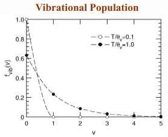

??? example "What is the Zeroth Law"
    Relates thermal equilibrium to the "hotness" of a body. As in, if all bodies have the same temperature, then they are in thermal equilibirum.

??? example "What is the First Law"
    Mass and energy or neither created or destroyed, they are only transformed between each other. Conservation of energy.

??? example "What is the Second Law"
    Determines the impossibility of reversing and natural process. Defines entropy.

??? example "What is the State Postulate"
    The number of independent Thermodynamic properties necessary to define a state.

??? example "What is an isolated, open, and closed system"
    And isolated system is one where energy and mass cannot cross the boundary. Open is where both can freely cross. Closed, energy can only cross.

??? example "What is a control mass? Volume"
    Control mass is one where it is a closed system. Control volume is one where it is a open system.

??? example "What is thermodynamic equilibrium"
    To achieved TD equilibrium, the system must also be in thermal, mechanical, chemical, and electro equilibrium. If of the equilibriums correspond to the uniformity of a state property of the system. Respectively, these are temperature, pressure, chemical potential, and electrical potential.

??? example "What is a Thermodynamic property"
    Attribute of a system that can be quantied. Volume, mass, energy, and pressure are all TD properties. Work and heat transfer are not.

??? example "What is an extensive property"
    Depends on size. Additive

??? example "What is an intensive property"
    Dependent on size. Not additive.

??? example "What is meant by state"
    Condition of the system.

??? example "What is meant by homogenous"
    The substance is of one phase.

??? example "What is a pure substance"
    A substance that has the same chemical structure in all states.

??? example "What is a reversible work mode"
    For $\delta W=Fdx$, F is independent of direction ad rate of change of the process.

??? example "What are independent ways to transfer energy"
    Reversible work modes and heat transfer.

??? example "What are some reversible work modes"
    Fluid compression/expansion, polarization, liquid surface extension.

??? example "What is a simple substance"
    Only one reversible work mode.

??? example "What is a simple compressible substance"
    Only reversible work mode is fluid compression/expansion.

??? example "What is the general definition of equation of state"
    Defines the relationship between thermodynamic properties. ~$p=p(\rho,T)$

??? example "What is needed to specify a substance"
    Need m-1 moles fraction $\chi_i$

??? example "Can you create an intensive from an extensive property"
    Yes. $=>E(m,I_1,I_2)=mg(I_1,I_2)=>\frac{E}{m}=g(I_1,I_2)$

??? example "What are some specific properties"
    General form $\frac{E}{m}$. Also $h=\frac{H}{m}$, $v=\frac{V}{m}$. Additionally you can create a volume specific property $\frac{H}{V}$.

??? example "In the classical thermodynamics context, what is temperature"
    A measure that quantifies the "hotness" of a system. Not an absolute reference, but can agree on relative "hotness".

??? example "What must be true for temperature to be defined"
    Body is in thermal equilibrium.

??? example "What is the PG (Perfect Gas) temperature scale"
    A system filled in a constant volume gas, can show that T is monotonically increasing as a function fo the gas state.

??? example "What is the difference between $\delta$ and d. (As in $\delta w$ vs $du$)"
    The value obtained through $\delta$ is path dependent, where as the $d$ is state dependent and will return the same value no matter the path.

??? example "Describe $dU=\delta Q+\delta W$"
    The change in internal energy (which is a state property) can be equation to the path dependent values of heat transfer and work.

??? example "What is U"
    Internal energy. Extensive property. Sum of the rotational, vibrational, and electric energy.

??? example "Draw a cyclic process and what are it's associated equations"
    === "Equations"
        \begin{equation*}
            \begin{split}
                \oint dU = U_1 - U_1 &= \oint \delta Q + \oint \delta W = Q + W\\
                Q&=-W\\
            \end{split}
        \end{equation*}
    === "Figure"
        <figure markdown="span">
            { width="400" }
        </figure>

??? example "What is the first law but for fluid work only"
    $$\delta W=-pdV \xrightarrow{} dU=Q_{12}-pdV$$

??? example "What is heat of reaction"
    $\Delta H_R^o$ the value of the amount of energy per mole either related or produced in a reaction.

??? example "In the context of classical thermo, what is entropy"
    A property of a system which differentiates what is impossible in relation to reversibility. An extensive property.

??? example "What is a conservative force"
    A force whose total expenditure of work is independent of direction. Example is fluid compression. A non-conservative force is friction.

??? example "In a classical equilibirum context, what is temperature"
    \begin{equation*}
        \begin{split}
            \text{Temperature is the value found}&\text{ such that entropy (S) is maximized.}\\
            T&=\frac{1}{\left(\frac{\partial S}{\partial V}\right)_U}
        \end{split}
    \end{equation*}

??? example "What is the thermodynamic definition of pressure"
    $$P=T\left(\frac{\partial S}{\partial V}\right)_U$$

??? example "Within the context of classical thermodynamics, when is temperature and pressure valid"
    TD Equilibrium

??? example "What is the Gibbs Equation"
    \begin{equation*}
        \begin{split}
            dS&=\left(\frac{\partial S}{\partial U}\right)_VdU+\left(\frac{\partial S}{\partial V}\right)_UdV\\
            dS&=\frac{1}{T}dU+\frac{P}{T}dV
        \end{split}
    \end{equation*}

??? example "How can you transfer entropy from a closed system"
    Heat transfer

??? example "How is entropy produced"
    When there is heat transfer across a finite temperature difference.

??? example "When is an isentropic system reversible"
    When it is also adiabatic or there is no heat transfer.

??? example "For a control mass, what is the second law"
    $$dS_{CM}=\frac{\partial Q}{T}+\partial P_s$$

??? example "What is the maximum work attainable from a system"
    When $\delta\mathcal{P}_s=0$

??? example "What is (Carnot) efficiency"
    $$\eta=\frac{W_{out}}{Q_{in}}\text{, }\eta_{rev}=\frac{W_{max}}{Q_1}=1-\frac{T_2}{T_1}$$

??? example "What is the thermodyanimc definition of chemical potential"
    $$\mu=-T\left(\frac{\partial S}{\partial n_i}\right)_{U,V,n_{i\neq j}}$$

??? example "What is the difference between phase and chemical equilibirum"
    Two system is considered in **phase equilibirum** if $\mu_{liq}=\mu_{ice}$. For **chemical equilibirum** if $N_2+O_2\xrightarrow{}2NO$ then $\mu_{N_2}+\mu_{O_2}=2\mu_{NO}$

??? example "What is the relationship of $\mu$ to G,H, and F"
    $$\mu_i=\left(\frac{\partial G}{\partial n_i}\right)_{T,P}=\left(\frac{\partial H}{\partial n_i}\right)_{S,P}=\left(\frac{\partial F}{\partial n_i}\right)_{T,V}$$

??? example "What is the requirement for $dS\geq 0$, $dF\leq 0$, $dG\leq 0$"
    For dS, U and V are const. For F, T and V are const. For G, T and P. For all $\Sigma\mu_i dn_i\leq 0$

??? example "What are the identifies for H, G, and F"
    $H=U+PV$, $G=H-TS$, $F=U-TS$

??? example "van't Hoff Relation"
    $$\left(\frac{\partial G/T}{\partial T}\right)_{P,n_i}=-\frac{H}{T^2}$$

??? example "Relate $C_v$ and $C_p$ to U and H"
    \begin{equation*}
        \begin{split}
            dU&=\left(\frac{\partial U}{\partial T}\right)_V dT+\left(\frac{\partial U}{\partial V}\right)_T dV \\
            dH&=\left(\frac{\partial H}{\partial T}\right)_P dT+\left(\frac{\partial H}{\partial P}\right)_T dP \\
        \end{split}
    \end{equation*}

??? example "Relate $C_v$ and $C_p$ to Q"
    \begin{equation*}
        \begin{split}
            &\text{Starting with }dU=\delta Q-pdV\text{ For $C_v$ meaning constant volume and using }dU=C_vdT\text{, we find}\\
            &C_v=\frac{\partial Q}{dT}\\
            &\text{Similarly for $C_p$ ~ }dH=C_pdT \\
            &C_p=\frac{\partial Q}{dT}\\
        \end{split}
    \end{equation*}

??? example "Forms for isobaric, isothermal, and isentropic compressibility"
    \begin{equation*}
        \begin{split}
            \alpha=\frac{1}{V}\left(\frac{\partial V}{\partial T}\right)_P\\
            \kappa=-\frac{1}{V}\left(\frac{\partial V}{\partial P}\right)_T\\
            \beta=-\frac{1}{V}\left(\frac{\partial V}{\partial P}\right)_S
        \end{split}
    \end{equation*}

??? example "For a perfect gas, $C_p-C_v=R$. What is it for a real gas"
    $$C_p-C_v=T\frac{\alpha^2 V}{\kappa}$$

??? example "For a perfect gas, $C_p/C_v=\gamma$. What is it for a real gas"
    $$\frac{C_p}{C_v}=\frac{\kappa}{\beta}$$

??? example "Entropic state relation"
    \begin{equation*}
        \begin{split}
            dS&=\left(\frac{\partial S}{\partial T}\right)_P dT+\left(\frac{\partial S}{\partial P}\right)_T dP\\
            dS&=C_P dT\frac{dT}{T}-\alpha VdP\\
            dS&=C_V dT\frac{dT}{T}-\frac{\alpha}{\kappa}dP
        \end{split}
    \end{equation*}

??? example "Enthalpic state equation"
    $$dH=C_p dT+(1-\alpha T)VdP$$

??? example "Internal energy state equation"
    $$dU=(C_p-\alpha PV)dT-(\alpha T-\kappa P)VdP$$

??? example "What is the difference between -,^,~ (i.e $\bar{u}$, $\hat{h}$, $\tilde{s}$)"
    $\frac{\partial X}{\partial n}$, $\frac{X}{n}$, (RECHECK)

??? example "What is the first law Reynolds Transport Theorem for a control volume. Describe each term"

    $$\underset{\text{energy transfer rate into CV from Q+W}}{\dot{Q}+\dot{W}_u+\dot{W}_{boundary}+\dot{W}_{body}}=\underset{\text{rate of change of energy inside CV}}{\frac{d}{dt}\int_{cv}\rho edV}+\underset{\text{net rate energy flows out of CV carried by mass}}{\int_{cs}e(\rho \vec{v}_{rel}\cdot \hat{n})dA}$$

??? example "From $\dot{Q}+\dot{W}_u+\dot{W}_{boundary}+\dot{W}_{body}=\frac{d}{dt}\int_{cv}\rho edV+\int_{cs}e(\rho \vec{v}_{rel}\cdot \hat{n})dA$.  Change this equation to be steady uniform"
    $$\dot{Q}+\dot{W}_u=\dot{m}\left(h_{out}+\frac{v^2_{out}}{2}\right)-\dot{m}\left(h_{in}+\frac{v^2_{in}}{2}\right)$$

??? example "Second law Reynolds Transport Theorem for control volume"
    $$\dot{\mathcal{P}}_s+\int_{CS}\frac{\dot{Q}^{''}}{T}dA=\frac{d}{dt}\int_{CV}\rho sdV+\int_{CS}s(\rho\vec{v}_{rel}\cdot\hat{n})dA$$

??? example "Control volume equation for min and max $W_u$"
    $$w_{u,min\text{ }in}=(h_{out}-h_{in})-T_{wall}(s_{out}-s_{in})$$

    $$w_{u,max\text{ }out}=(h_{in}-h_{out})-T_{wall}(s_{in}-s_{out})$$

??? example "Describe the relationship between G and $W_u$. Now for F"
    \begin{equation*}
        \begin{split}
            W_{u,out}&\leq-(G_2-G_1)\\
            W_{u,out}&\leq-(F_2-F_1)
        \end{split}
    \end{equation*}

??? example "What is an ideal gas. Perfect? Thermally perfect? Calorically perfect?"
    Ideal gas is a calorically and thermally perfect gas. Perfect gas or thermally perfect, is one that follows the ideal gas law. Calorically perfect is one who specific heat properties are constant regardless of temperature.

??? example "Entropic state relation"
    $$\left(\frac{T_2}{T_1}\right)=\left(\frac{v_2}{v_1}\right)^{1-n}=\left(\frac{T_2}{T_1}\right)^{\frac{n-1}{n}}$$

    \begin{equation*}
        \begin{split}
        &\text{0 isobaric}\\
        &\text{1 isothermal}\\
        &\text{$\gamma$ isentropic}\\
        &\text{$\infty$ isochoric}\\
        \end{split}
    \end{equation*}

??? example "Define a thermally perfect gas mixture"
    $$\mu_i=\underset{\text{independent of composition}}{\mu_i^o(T)+\bar{R}T\ln\frac{p}{p^o}}+\underset{\text{simple composition dependence}}{\bar{R}T\ln\chi_i}$$

??? example "Entropy due to mixing"
    $$\frac{\Delta G_{mix}}{T}=-\Delta S_{mix}=\overline{R}\sum_i n_i\ln\frac{p_i}{p^i}$$

??? example "Where is perfect gas law limited"
    Low pressure or high temperature

??? example "Compressibility factor"
    $$Z=\frac{PV}{\overline{R}T}$$

??? example "What does ideal gas no account for"
    Molecular interactions

??? example "Van der Waals equation"
    $$\left(p+\frac{a}{\hat{v}^2}\right)\left(\hat{v}-b\right)=\overline{R}T$$

??? example "What is reduced temperature and pressure"

    === "Equations"
        \begin{equation*}
            \begin{split}
                &T_r=\frac{T}{T_c}\\
                &P_r=\frac{P}{P_c}\\
                &\text{where c is critical (as in critical temperature/pressure)}\\
            \end{split}
        \end{equation*}

    === "Figure"
        

??? example "Equilibrium constant $K_p$"
    \begin{equation*}
        K_p\equiv\prod p_i^{*v_i}=\left(\frac{P_{c}^{c}P_{d}^{d}}{P_{a}^{a}P_{b}^{b}}\right)=e^{\frac{-\Delta G_T^o}{\overline{R}T}}
    \end{equation*}

??? example "Law of Mass Action"
    If we have the reaction $aA+bB\rightarrow cC+dD$

    $$K=\frac{[C]^c[D]^d}{[A]^a[B]^b}$$

??? example "What is concentration"
    $$[M]=\frac{n_m}{V}=\frac{p_i}{\overline{R}T}$$

??? example "K_c vs K_p"
    $$K_c(T)=\prod_i[M_i]^{*v_i}=\frac{K_p(T)}{(\overline{R}T)^{\sum v_i}}$$

??? example "Relationship between $K_p$ and $T$"
    $$\frac{d\ln K_p}{dT}=\frac{\Delta\hat{H}_R(T)}{\overline{R}T^2}$$

??? example "Endothermic vs Exothermic reaction"
    Endothermic - $\Delta H_R>0$

    Exothermic - $\Delta H_R<0$

??? example "Standarized Enthalpy"
    $$(H_T^o)_i=\underset{\text{Chemical energy}}{(\Delta H_{f,T_{ref}}^o)_i}+\underset{\text{Sensible enthalpy}}{(H_T^o-H_{T_{ref}}^o)}$$

??? example "Limitations on classical thermodynamics"
    Can't provide prediction on certains thermodynamic properties

??? example "Bohr's model of an atom"
    1. Consist of nucleus and electrons
    2. Discrete orbits
    3. Electromagnetic radiation emitted/absorbed when orbit changes
    4. Angular momentum quantized

??? example "Major correction to Bohr's model"
    Bohr-Sommerfield Orbits

??? example "Consequence of photon momentum"
    Uncertainty principle

    $$\Delta x|\Delta p_x|\geq\frac{h}{2\pi}$$

??? example "Consequency of uncertainty principle"
    Causality is broken. Requires use of probabilities.

??? example "Schrodingers equation"
    $$i \hbar \frac{\partial \Psi(\mathbf{r}, t)}{\partial t} = -\frac{\hbar^2}{2m} \nabla^2 \Psi(\mathbf{r}, t) + V(\mathbf{r}, t) \Psi(\mathbf{r}, t)$$

    $\nabla^2$ is the Laplacian operator. $V(\mathbf{r}, t)$ is the potential energyt from field in which particle is moving.

??? example "Translational energy level solution"
    $$\varepsilon_{i,n_i}=\frac{h^2}{8m}\frac{n_i^2}{L_i^2}$$

??? example "Non-degenerate vs degenerate state"
    Non-degenerate state is one which each specific energy state has difference energy. Degenerate is when more than one state has the same energy

??? example "What is the degneracy of an energy level"
    When more than one state has the same energy level

??? example "Reduced Mass"
    $$\mu=\frac{m_1m_2}{m_1+m_2}$$

??? example "What are types of vibration modes? What is the energy level solution"
    Bending, symmetric, asymmetric stretch

    $$\varepsilon_v=h\nu(v+\frac{1}{2})$$

??? example "Linear vs non-linear molecule"
    2 vs 3 axes of rotation

??? example "Rigid rotor energy level solution"
    $$\varepsilon_J=J(J+1)\frac{\hbar}{2I}$$

??? example "What are some quantum numbers"
    radial (n), orbital (l), magnetic (m)

??? example "What is an Ensemble model"
    Collection of a large number os systems where each replicates macroscopic thermodynamic properties of a system of interest. An entire ensemble is considered isolated.

??? example "What is $\Omega$"
    Total number of microstates with a required macroscopic properties. Or $\Omega=\underset{\text{microstates with }\sum N_i=N,\sum N_i\varepsilon_i=E}{\sum 1}$

??? example "What is an extended degeneracy"
    Where additional energy states are close enough to be considered within the same bin. $\varepsilon_a\approx\varepsilon_b$

??? example "What are 5 different statistical situations"
    1. Boltzmann with degeneracy
    2. Boltzmann without degeneracy
    3. Corrected Boltzmann
    4. Bose-Einstein statistic
    5. Fermi-Dirac statistic

??? example "Macrostate"
    Distribution of particles across energy levels

??? example "What is $W(N_i)$"
    Number of microstates in a specific microstate

??? example "When is the boltzmann limit not reasonable"
    Low temperature or high pressure

??? example "What is a constraint for an allowed macrostate"
    $\Sum N_i=N$, $\Sum N_i\varepsilon_i=E$

??? example "What does the most probable energy macrostate state mean"
    Represents thermodynamic equilibrium particle distribution

??? example "What is the general form of the energy level population distribution"
    $$N_i^*=g_ie^{-\alpha-\beta\varepsilon_i}\text{,   }N_{i,\left[\frac{BE}{FD}\right]}^*=g_i\frac{e^{-\alpha-\beta\varepsilon_i}}{1\mp e^{-\alpha-\beta\varepsilon_i}}$$

??? example "What is the partition function"
    $$Q=\Sum_i g_i e^{-\beta\varepsilon_i}$$

??? example "Max probable population distribution"
    $$\frac{N_i}{N}=\frac{g_i g^{-\beta\varepsilon_i}}{Q}$$

??? example "Fundamental Postulate of Statistical Mechanics"
    Most probable contains nearly all microstates, assuming equal a priori probability for each microstate meeting E, N constraints.

??? example "General Boltzmann Relation"
    $$S=k\ln\Omega+S_o$$

??? example "For the corrected boltzmann, what is the statistical thermodynamic equation for entropy"
    $$S=kN\ln\frac{Q}{N}+kN+k\beta E$$

??? example "Pressure for statistical thermodynamics"
    $$\frac{P}{T}=kN\left(\frac{\partial\ln Q}{\partial V}\right)_{E,N(T)}$$

??? example "Chemical potential for statistical thermodynamics"
    $$\frac{\tilde{\mu}}{T}=-k\ln\frac{Q}{N}$$

??? example "Internal energy for statistical thermodynamics"
    $$E=NkT^2\frac{\partial\ln Q}{\partial T}$$

??? example "Specific heat for statistical thermodynamics"
    $$c_v=R\left[2T\frac{\partial\ln Q}{\partial T}+T^2\frac{\partial^2\ln Q}{\partial T^2}\right]$$

??? example "How do the multipliers differ between corrected boltzmann and FD-BE"
    $\beta=\frac{1}{kT}$ is the same but $\alpha=-\frac{\tilde{\mu}}{kT}$ for FD-BE

??? example "Can we use corrected boltzmann for interacting particles"
    No, need ensemble model.

??? example "What is the statistical thermodynamic interpretation of temperature"
    A measure of how particles are distributed among energy levels

??? example "Graphically, show the statistical interpretation of temperature"
    

??? example "What is an interpretation of Q"
    Q is the sum of all quantum states weighted by accessbility

??? example "What are the relevant energy modes"
    Translational, rotational, vibrational, electronic

??? example "Equation for the translational partition function"
    $$Q_{tr}=\left(\frac{2\pi mkT}{h^2}\right)^{3/2}V$$

??? example "Thermal DeBroglie Wavelength"
    $$\Lambda=\left(\frac{h^2}{2\pi mkT}\right)^{1/2}$$

??? example "From translational properties, what is pressure"
    $$p_{tr}V=NkT$$

??? example "From translational properties, what is energy. Specific heat"
    $$\frac{E_{tr}}{N}=\frac{3}{2}kT$$

    $$C_{v,tr}=\frac{3}{2}R$$

??? example "For purely translating particles, what assumptions used in classical thermo becomes valid"
    Thermally and calorically perfect.

??? example "Equipartition of energy"
    $c_v/R$ - quadratic work modes $\times$ $1/2$

??? example "General form of the electric energy mode partition function"
    $$Q_{el}=g_0+g_1 e^{-\theta_{el,2}/T}+g_2 e^{-\theta_{el,2}/T}+...$$

??? example "Rotationl partition function"
    $$Q_{rot}\equiv\frac{T}{\theta_r\sigma}$$

    If homogenous $\sigma=2$ else $\sigma=1$

??? example "Vibrational partition function"
    $$Q_{vib}=\frac{e^{-\theta_v/2T}}{1-e^{-\theta_v/T}}$$

    Or is lowest vibrational energy level has zero energy 
    
    $$\frac{1}{1-e^{-\theta_v/T}}$$

??? example "For each energy mode, what is the associated equipartition (Diatomic)"
    Translational - 3

    Rotational - 2

    Vibrational - 2

??? example "What effects become important at higher temperature"
    Anharmonic, vibrational and rotational coupling

??? example "Why does rotational population distribution have a peak while vibrational max is at 0"
    Rotational has degeneracy ($g_i$)

??? example "With $N_i/N=f_i(T)$. What is the form of f for all the modes (Boltzmann fraction)"
    === "Tranlational"
        $$f_{tr}=\frac{e^{-\theta_{tr}n^2/T}}{\left(2\pi mkT/h^2\right)^{3/2}V}$$

        <figure markdown="span">
            
        </figure>

    === "Rotational"
        $$f_{rot}=\frac{(2J+1)e^{-\theta_{rot}J(J+1)/T}}{T/\sigma\theta_r}$$

        <figure markdown="span">
            
        </figure>

    === "Vibrational"
        $$f_{vib}=e^{-\nu\theta_v/T}\left(1-e^{-\theta_v/T}\right)$$

        <figure markdown="span">
            
        </figure>

    === "Electric"
        $$f_{el}=\frac{g_ie^{-\theta_{el,i}/T}}{g_0+g_1e^{-\theta_{el,1}/T}+g_2e^{-\theta_{el,2}/T}+...}$$

        <figure markdown="span">
            
        </figure>

??? example "Boltzmann plot and consequence"
    <figure markdown="span">
        
    </figure>

    Can determine if system is in equilibrium. Is possible distribution is not boltzmann.

??? example "Corrections to simple energy models"
    - Centrifugal distortion
    - Vibrational-rotation coupling
    - Anharmonic oscillation
    - Interaction of rotation-electronic

??? example "Number of vibrational modes for polyatomics"
    - linear - 3N-5
    - nonlinear - 3N-6

??? example "Vibration partition function for $N_{vib}$ different modes"
    $$Q_{vib}=\prod_{i=1}^{N_{vib}}\frac{e^{-\theta_{vi}/2T}}{1-e^{-\theta_{vi}/T}}$$

??? example "Rotational partition functions for polyatomics"
    === "Linear $I_A=I_B$, $I_C=0$"
        $$Q_{rot}=\frac{T}{\sigma\theta_r}$$

    === "Spherical $I_A=I_B=I_C$"
        $$Q_{rot}=\frac{\pi^{1/2}}{\sigma}\left(\frac{T}{\theta_r}\right)^{3/2}$$

    === "Symmetric Top $I_A=I_B\neq I_C$"
        $$Q_{rot}=\frac{\pi^{1/2}}{\sigma}\left(\frac{T}{\theta_{r_A}}\right)\left(\frac{T}{\theta_{r_C}}\right)^{1/2}$$

    === "Asymmetric Top $I_A\neq I_B\neq I_C$"
        $$Q_{rot}=\frac{\pi^{1/2}}{\sigma}\left(\frac{T}{\theta_{r_A}}\right)^{1/2}\left(\frac{T}{\theta_{r_B}}\right)^{1/2}\left(\frac{T}{\theta_{r_C}}\right)^{1/2}$$
    
??? example "What is dissociation energy of AB"
    $$\Delta\varepsilon_0=\varepsilon_0^{AB}-\left(\varepsilon_0^{A}+\varepsilon_0^{B}\right)=-D$$

    ~ $D_0$ vs $D_e$

??? example "Equilibrium constant"
    For $aA+bB\leftrightarrow{}cC$

    \begin{equation*}
        \begin{split}
            \frac{(N^c)^c}{(N^A)^a(N^B)^b}&=\frac{(Q^c)^ce^{-\Delta\varepsilon_0/kT}}{(Q^A)^a(Q^B)^b}\\
            K_p&=\left(\right)^{c-(a+b)}\frac{(Q^c)^ce^{-\Delta\varepsilon_0/kT}}{(Q^A)^a(Q^B)^b}\\
            K_p(T)&=\prod^{v_s}p_i\\
            &=\left(\frac{kT}{V}\right)^{\sum v}\left(\prod Q_s^{v_s}\right)e^{\left(\sum vD\right)/kT}
        \end{split}
    \end{equation*}

??? example "Equation for reacting gas mixture for specific heat. Describe the components"
    $$c_p=\underbrace{\frac{1}{m_{mix}/n_{tot}}}_{\substack{\text{molecular weight}\\ \text{of mixture}}}\left[\underbrace{\sum_s \chi_s\overline{c}_{p_s}}_{\substack{\text{Frozen Cp}}}+\underbrace{\sum_s\overline{h}_s\left.\frac{\partial\chi_s}{\partial T}\right |_p}_{\substack{\text{Chemical Cp}}}\right]$$

    - Frozen Cp or the Cp of mixture for no change in composition
    - Chemical Cp or the contribution of Cp due to change in composition
    - Uses common energy zero/datum

??? example "What is the photon energy and momentum equations"
    $\varepsilon=h\nu$, $p=h/\lambda=h\nu/c$  where $\lambda=c/\nu$

??? example "A body in equilibrium with the radiation field"
    Blackbody

??? example "Planck's law follows which statistic"
    Bose-Einstein (no Pauli exclusion)

??? example "Describe the components of the random statical motion"
    

??? example "What does the intermolecular potential model. Additional give a simple example"
    === "Summary"
        Short range attractive intermolecular forces of neutral molecules with electrostatic potentials
    === "Lennard-Jones"
        $$V(r)=4\varepsilon\left[\left(\frac{\sigma}{r}\right)^{12}-\left(\frac{\sigma}{r}\right)^{6}\right]$$
    === "Diagram"
        <figure markdown="span">
            
        </figure>

??? example "How do you derive pressure using kinetic theory"
    $$p=\frac{1}{3}mn\overline{C^2}$$

??? example "How do you derive energy using kinetic theory"
    $$E_{tr}=\frac{1}{2}(Vnm)\overline{C^2}=\frac{3}{2}Vp$$

??? example "How do you derive temperature using kinetic theory"
    $$T=\frac{2}{3}\frac{E_{tr}}{N\overline{R}}$$

??? example "What does pressure become with the intermolecular correction"
    $$p=nkT(1\pm and^3)$$

??? example "What is $\sqrt{\overline{C^2}}$"
    $$\sqrt{\frac{3kT}{M}}$$

??? example "What is the source of diffusion"
    Transport properties by the random motion of molecules

??? example "What are the different diffusional transport properties of a gas"
    === "Fourier's Law"
        $$q_2=-k\frac{dT}{dx_2}$$

        - $q_2$ heat flux
        - $k$ thermal conductivity
    === "Newtoninan Law"
        $$\tau_{12}=\mu\frac{du_1}{dx_2}$$

        - $\tau_{12}$ shear stress
        - $\mu$ dynamic viscosity
    === "Fickian Diffusion"
        $$j_{A,2}=-D_{AB}\frac{d\rho_A}{dx_2}$$

        - $j_{A,2}$ diffusive mass flux
        - $D_{AB}$ mass diffusivity

??? example "Collision frequency"
    $$\theta=n\sigma\overline{C}$$

??? example "Mean free path"
    $$\lambda=\frac{1}{\sqrt{2}n\sigma}$$

    $\sqrt{2}$ comes from using $\overline{g}$ where $\overline{g}=\sqrt{2}\bar{C}$

??? example "Pressure and temperature scaling for $\lambda$ and $\theta$"
    $$\lambda\propto\frac{T}{P}$$

    $$\theta\propto\frac{P}{T^{1/2}}$$

??? example "Molecular flux"
    Number of gas molecules per unit time passing through a differential area (dS)

??? example "What is $nC_2f(C_i)dV_c$"
    Differential number flux

??? example "What is the kinetic theory description of pressure equilibrium"
    Average of normal stress (momentum flux) in all 3 directions

??? example "Kinetic theory definition of heat diffusion"
    $$q_j=\frac{1}{2}\rho\overline{C_jC^2}$$

    Energy transport in j-direction due to random molecular motion

??? example "Kinetic theory definition of pressure diffusion"
    $$\tau_{ij}=-\rho\overline{C_iC_j}$$

    Tranverse momentum transport in the j-direction

??? example "What is the impact parameter and its relationship to collisions"
    === "Impact parameter (b)"
        - Closest distance that could occur between the centers of collision partners
        - Larger b, less likely collision with large deflection angle ($\chi$) would occur
    === "Diagram"
        <figure markdown="span">
            
        </figure>

??? example "What does a deflection angle ($\chi$) of 0 mean"
    No collision or no momentum transfer

??? example "What is $d\zeta_{AB}$"
    Differential collision rate

    $$d\zeta_{AB}=\frac{n_A n_B}{\delta_{AB}}f(c_i)f(z_i)g\sigma_{AB}(g,\chi)dV_cdV_zd\Omega$$

??? example "Bimolecular collision rate (generic)"
    $$z_{AB}=\frac{n_A n_B}{\delta_{AB}}\int_{-\infty}^{\infty}\int_{-\infty}^{\infty}f(c_i)f(z_i)g\sigma^{T}_{AB}(g)dV_cdV_z$$

??? example "In relation to collision rate, what implies equilibrium"
    $$[f_0(c_i')f_0(z_i')-f_0(c_i)f_0(z_i)]=0$$

    Replenishing and depleting rates cancel

??? example "What are the equilibrim distribution constaints (Maxwell Dist)"
    1. Random velocity
    2. PDF Normalized
    3. Perfect gas result

??? example "Maxwellian velocity distribution"
    $$f_0(c_i)=\left(\frac{m}{2\pi kT}\right)^{3/2}e^{-\frac{m}{2kT}C^2}$$

??? example "Maxwellian speed distribution"
    $$\chi_0(C)=\left(\frac{m}{2\pi kT}\right)^{3/2}4\pi C^2e^{-\frac{m}{2kT}C^2}$$

??? example "Describe the maxwell distribution, including key points"
    

??? example "Bimolecular collision rate (with velocity distribution)"
    $$z_{AB}=\frac{n_A n_B}{\delta_{AB}}\int_{-\infty}^{0}\left(\frac{m^*_{AB}}{2\pi kT}\right)^{3/2}e^{\frac{m^*_{AB}}{2kT}g^2}\sigma^{T}_{AB}(g)4\pi g^3 dg$$

??? example "Bimolecular collision rate for hard sphere"
    $$z_{AB}=\frac{n_A n_B}{\delta_{AB}}\sigma_{AB}\overline{g}$$

??? example "Bimolecular collision frequency for hard sphere"
    $$\theta_{AB}=n_B\sigma_{AB}\overline{g}$$

??? example "Mean free path (ADVANCED)"
    $$\lambda_A=\frac{\overline{C}_A}{\theta_A}$$

??? example "What happens to the diffusion variables ($q$, $\tau$, and $D$) if in equilibrium"
    They are all 0. These parameters are all manifestations of translational nonequilibrium.

??? example "In relation to shear stress, what is the molecular distirubtion at an initial point, near field, far field"
    === "Initial Point"
        Equilibirum

    === "Near Field"
        Non-equilibrium (gradients exists)

    === "Far Field"
        Pseudo equilibrium (gradients still exists but small enough to be in equilibrium)

??? example "What is inelastic vs elastic collisions"
    Elastic collision are pure translational. Inelastic implies some kinetic energy is imparted on internal energy.

??? example "What does endothermic and exothermic definitions"
    Increase and decrease in chemical energy, respectively.

??? example "What limits collisions that have sufficient relative translational kinetic energy to cause inelastic process to occur"
    Activation energy

??? example "Inelastic collision rate"
    $$z_{AB}^{process}=\frac{n_A n_B}{\delta_{AB}}\overline{g}\frac{1}{(kT)^2}\int_{\varepsilon_a}^{\infty}e^{\frac{-\varepsilon}{kT}}\sigma_{AB}^{process}\varepsilon d\varepsilon$$

    For $\varepsilon>\varepsilon_a$ then $\sigma_{AB}^{process}=\sigma_{int}(\varepsilon)$, which yields

    $$z_{AB}^{process}=\frac{n_A n_B}{\delta_{AB}}\overline{g}\sigma(T)e^{\frac{-\varepsilon_a}{kT}}$$

??? example "Given $A+B\rightarrow C+D$, related all the glorious reaction rates equations"
    \begin{equation*}
        \begin{split}
            \frac{dn_c}{dt}&=k_f n_A n_B\\
            k_f&=AT^{1/2}e^{-\varepsilon_a/kT}\\
            K_c(T)&=\frac{k_f(T)}{k_b(T)}=\frac{n_c^*n_D^*}{n_A^*n_B^*}
        \end{split}
    \end{equation*}

??? example "Describe the collision complex model"
    === "Description"
        - Based on the assumption that for the inelastic energy transfer process to take place, molecules temporarily form unstable collision complex that has high energy
        - So activation energy required to for the complex
        - example: Chemical reaction

    === "Diagram"
        

